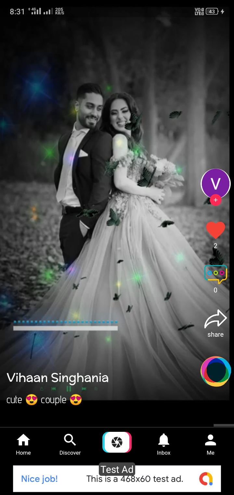
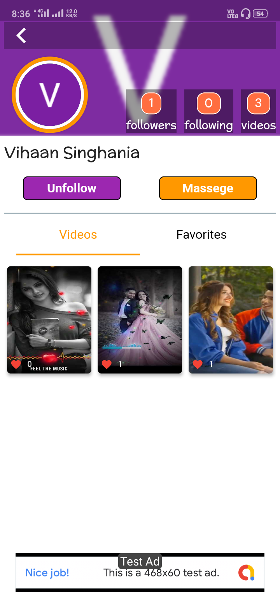
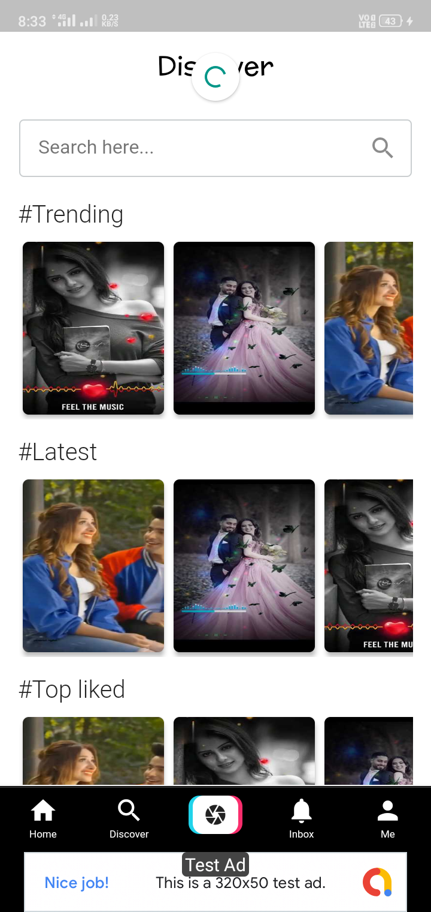
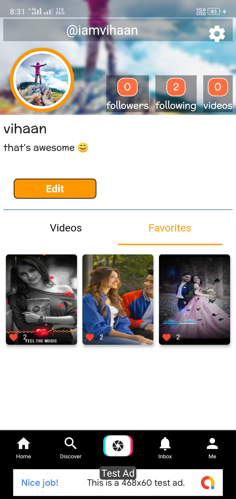
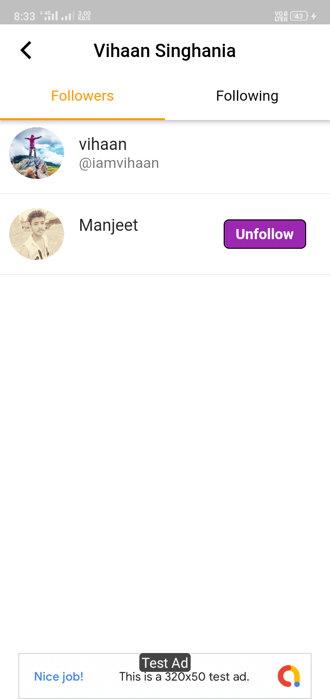
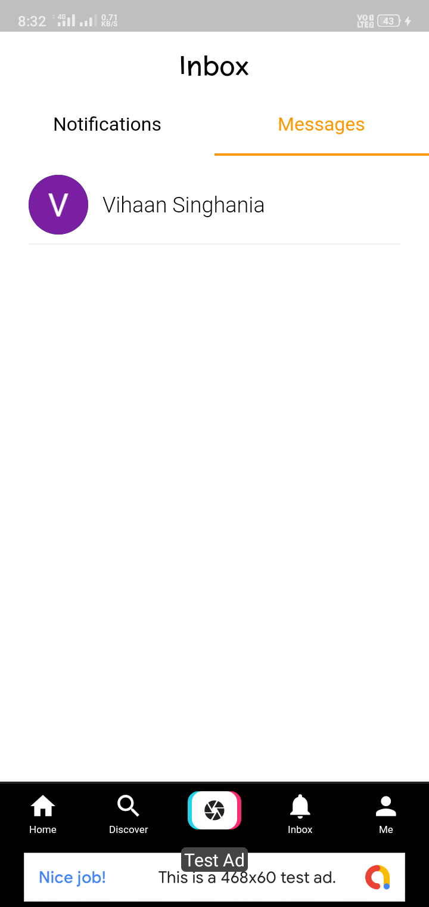

<h1 align="center">
     
    TikTok Flutter
</h1>
<h4 align="start">
 This is a basic mobile application that uses the flutter framework to create a clone of the Tik Tok App.
</h4>

### Some Screenshots

  

## Supported Features 

► Swipe Videos                                                            
► Dynamic Video Data Source                                                                  
► User Data (Name, Image)                                         
► Login with Google                            
► See videos                                              
► Like                                                            
► comment                                
► messaging                                   
► Follow                                                             
► unfollow                                                            
► Record new video                                                                                                 
► Upload clips                               
► TikTok UI                                                                 

## Database

The app obtains the data from PHP Admin Panel.
